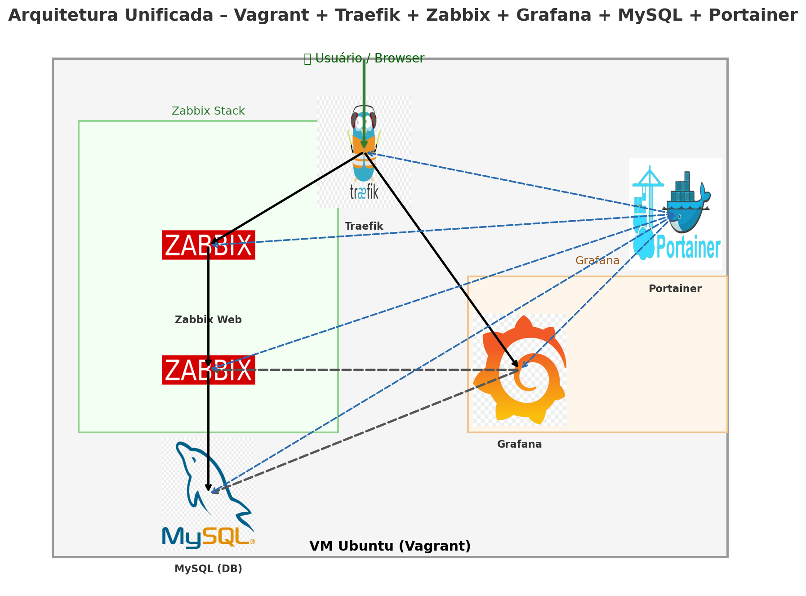

# Documentação do Projeto

## Serviços
- Portainer: http://192.168.56.50:9000
- Traefik Dashboard: http://192.168.56.50 ou http://traefik.marnep.com.br
- Zabbix: http://zabbix.marnep.com.br
- Grafana: http://grafana.marnep.com.br

## Credenciais
- Traefik: admin / admin
- Zabbix: Admin / zabbix
- Grafana: admin / admin
- Portainer: definir no primeiro acesso

---

## Checklist de Validação de Desempenho
- CPU: 2 vCPUs
- Memória: 4 GB
- Teste de containers: `docker ps -a`
- Logs: `docker compose logs <serviço>`

---

## 🖼️ Arquitetura do Projeto

